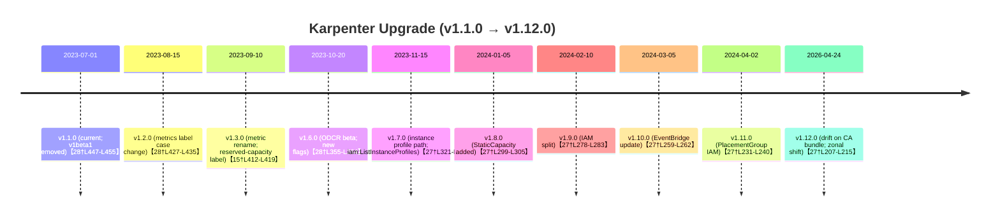

# Executive Summary

Upgrading **Karpenter** from v1.1.0 to v1.12.0 is **feasible** but requires careful planning.  The v1.1.0 release already **dropped support for v1beta1 APIs** (requiring prior migration to v1)【28†L447-L455】【28†L459-L468】.  Subsequent versions (v1.2.0 through v1.12.0) introduced numerous feature changes and minor breaking points. Key items include renamed metrics, new features (static capacity, DR-agnostic scheduling, zonal shift), and required IAM/ RBAC updates (see timeline below). Notably, **no major CRD schema overhauls** occurred after v1.0, but conversion webhooks (introduced in v1.0.0) must be functioning properly to translate any v1beta1 resources【28†L474-L478】.  

We recommend a **staged upgrade** (testing each major release if possible), with thorough pre-checks (CRD versions, conversion webhooks, IAM roles) and backups. The upgrade path should follow the sequence 1.1.0 → 1.2.0 → … → 1.12.0, paying special attention to each version’s notes【27†L207-L216】【28†L447-L455】. Below we summarize breaking changes per version, list detection commands, provide diff/Helm commands, and a risk matrix. A mermaid timeline and final recommendations conclude this report.

## Breaking Changes & Notable Updates by Version

- **v1.1.0 (baseline)** – Already active, **support for v1beta1 APIs and annotations was dropped**. All NodePools/NodeClaims must use `apiVersion: karpenter.sh/v1` and include `nodeClassRef.group` and `kind`【28†L447-L455】. Bottlerocket support now auto-RAID0’s instance store (requires Bottlerocket ≥ v1.22.0)【28†L447-L455】. Neuron accelerator labels were corrected (`trainium`, `inferentia2` etc.)【28†L459-L468】.  Karpenter stops using an internal `karpenter.k8s.aws/cluster` tag, favoring `eks:eks-cluster-name`【28†L459-L468】. Generic operator metrics were replaced by resource-specific ones【28†L459-L468】.

- **v1.2.0** – Metrics label changes: several “reason” label values were changed from CamelCase to snake_case (e.g. `Drifted` → `drifted`)【28†L427-L435】. The `nodeclass.status` and `nodeclass.termination` controllers were **merged into a single “nodeclass” controller**, so any scripts or dashboards referencing `nodeclass.status` or `nodeclass.termination` must be updated【28†L427-L435】.

- **v1.3.0** – Renamed an alpha metric: `karpenter_ignored_pod_count` → `karpenter_scheduler_ignored_pod_count`【15†L412-L419】. Introduced a new `karpenter.sh/capacity-type: reserved` label under the `ReservedCapacity` feature flag – workloads selecting only `on-demand` via nodeSelector *may* need updated affinity rules to use reserved capacity【15†L412-L419】.

- **v1.4.0 & v1.5.0** – **No breaking changes** reported【15†L396-L400】【28†L379-L388】. These releases were mainly bug fixes and enhancements.

- **v1.6.0** – Native OCI-based spot (Open DRA) support graduated to beta and is enabled by default.  A new `MinValuesPolicy` option was added (default “Strict”) and a `DisableDryRun` flag (available in v1.6.2+) for EC2NodeClass validation【28†L355-L364】.  Upgrade notes: if still using the old open capacity reservation, migrate to the native support as per the [ODCR migration guide](https://karpenter.sh/docs/upgrading/odcr/)【28†L355-L364】.

- **v1.7.0** – **Instance profile path changed**: Karpenter now creates IAM instance profiles under a structured path (`/karpenter/<region>/<cluster>/<nodeclass-uid>/`) instead of root. No action is needed for existing profiles, but **new IAM permissions** are required: the controller role must allow `iam:ListInstanceProfiles`【27†L321-L330】.  Metrics changes: `karpenter_pods_pods_drained_total` was renamed to `karpenter_pods_drained_total`, and one reason label in `karpenter_nodeclaims_disrupted_total` changed (e.g. `liveness` → `registration_timeout`)【27†L333-L339】. Also, **DRA (Open DRA)** with `ResourceClaims` requests will now be ignored (older versions would ignore them silently) – no backward compatibility.

- **v1.8.0** – Introduced **Static Node (StaticCapacity)** support. Ensure your CRDs are upgraded so the new `Static` provisioner fields work【27†L299-L305】. (Note: v1.8.4 had a known topology-spread constraint regression; avoid exactly v1.8.4【27†L299-L305】.) 

- **v1.9.0** – The official IAM policy (e.g. CloudFormation template) was split into 5 finer-grained policies【27†L278-L283】. If you manage IAM policies manually or via the stack, you must attach all 5 new policies to the controller role. (Permissions themselves did not change; only splitting.) 

- **v1.10.0** – Added an extra EventBridge `detail-type` for Spot Interruption (EC2 Capacity Reservation) events【27†L259-L262】. If using Spot ODCRs (OneDirResv), update any EventBridge rule filters to include this new detail type. No other breaking changes.

- **v1.11.0** – Updated IAM for Placement Group support: the controller role now needs `ec2:DescribePlacementGroups` and access to `arn:aws:ec2:*:placement-group/*`【27†L231-L240】. If using placement groups, update your IAM.

- **v1.12.0** – Support for **drift on CA Bundle** (node labels): existing nodes will be marked “drifted” when the CA certificate changes (new hashing logic)【27†L207-L216】. Added **AWS ARC Zonal Shift** (opt-in feature; disabled by default) – requires new IAM: `arc-zonal-shift:GetManagedResource`【27†L207-L216】. Also, the controller needs `ec2:DescribeInstanceStatus` for enhanced instance health checks on interruptions【27†L214-L218】.

*For full changelogs, see the Karpenter v1.x GitHub releases【27†L207-L216】【28†L447-L455】 (links to both core and AWS-provider repos).  Each release’s notes and Karpenter documentation should be reviewed for detailed instructions.* 

## CRDs, Conversion Webhooks & API Changes

- **CRD Versions**: Karpenter’s CRDs (NodePool, NodeClaim, EC2NodeClass) must be updated alongside the controller. Helm **does not upgrade CRDs by default** when using the monolithic chart【8†L175-L184】. Instead, install/upgrade the **karpenter-crd** chart (independent Helm chart) in your namespace to apply new CRD definitions【8†L175-L184】. Example:
  ```sh
  KARPENTER_NAMESPACE=kube-system
  helm upgrade --install karpenter-crd oci://public.ecr.aws/karpenter/karpenter-crd \
    --version 1.12.0 --namespace "${KARPENTER_NAMESPACE}"
  ```
  This ensures CRDs are at the correct versions. 

- **Conversion Webhooks**: Since v1.0.0, Karpenter uses conversion webhooks to allow both v1beta1 and v1 API users【28†L474-L478】. If your cluster was migrated before v1.1.0, this should be working. Verify the **ValidatingWebhookConfiguration** for karpenter exists and is healthy (e.g. `kubectl get validatingwebhookconfiguration karpenter.k8s.aws`). If conversion webhooks fail, v1 resources may not be converted properly. 

- **StoredVersions**: Check each CRD’s storedVersions. For example:
  ```sh
  kubectl get crd/nodepools.karpenter.sh -o jsonpath='{.status.storedVersions}' 
  kubectl get crd/nodeclaims.karpenter.sh -o jsonpath='{.status.storedVersions}' 
  kubectl get crd/ec2nodeclasses.karpenter.k8s.aws -o jsonpath='{.status.storedVersions}'
  ```
  Ideally, these should list the versions (e.g. `v1`, `v1beta1` if conversion enabled). If you see stale versions or missing v1, reapplying the CRD via `karpenter-crd` chart will fix it.

- **Existing Manifests/API Versions**: Scan your cluster for any old CRs using v1beta1, which would break in 1.1+. For example:
  ```sh
  kubectl get nodepools -A -o jsonpath='{.items[*].apiVersion}' | sort | uniq
  kubectl get nodeclaims -A -o jsonpath='{.items[*].apiVersion}' | sort | uniq
  ```
  All must be `karpenter.sh/v1` (or `k8s.aws/v1` for EC2NodeClass). If you find `v1beta1`, convert them to `v1` before upgrading (the migration guide【28†L447-L455】).

## Helm Chart Changes & Diffing

Use `helm pull` and `helm template` to inspect chart/template changes between versions. For example, to compare charts for 1.1.5 and 1.1.6 (both image tag 1.1.0):

```sh
helm pull devops-cw/dcx-karpenter --version 1.1.5 --untar -d old
helm pull devops-cw/dcx-karpenter --version 1.1.6 --untar -d new
diff -u old/dcx-karpenter Chart.yaml new/dcx-karpenter/Chart.yaml
diff -ru old new | less
```

Notable chart diffs observed (from 1.1.5→1.1.6):
- **RBAC**: Added rules to read CRDs (`apiGroups: apiextensions.k8s.io`) and to read `leases` in `kube-node-lease` namespace. Also added permission to read `secrets` where only `configmaps` were before. These changes are minor (new RBAC) but may require updating the Helm `serviceAccount` policies in restrictive environments.
- **No image or API changes**: The controller image tag remained `1.1.0` in both, so chart bump was non-functional aside from the above RBAC.

In general, review the chart’s default values (via `helm show values`) for any new parameters (e.g. flags for static capacity, leader election, feature gates).  Check `values.yaml` changes between releases:
```sh
helm show values devops-cw/dcx-karpenter --version X.Y.Z > values-X.Y.Z.yaml
diff -u values-1.1.0.yaml values-1.12.0.yaml
```
This will reveal any new default flags (e.g. `featureGates.StaticCapacity`, leader election timeouts, etc.).

## Risk Assessment

| **Risk / Change**                          | **Severity** | **Likelihood** | **Mitigation**                                          |
|--------------------------------------------|-------------|---------------|---------------------------------------------------------|
| **v1beta1 API removal** (1.1.0+)           | High        | Medium        | Confirm no v1beta1 CRs exist (see commands above) and use conversion webhooks to migrate. Back up NodePool/NodeClaim YAMLs. |
| **CRD mis-versioning**                     | High        | Low           | Reapply CRDs via `karpenter-crd` chart; verify `.status.storedVersions`. Use `kubectl get crd` commands above. |
| **Conversion webhook failures**            | High        | Low-Med       | Ensure `ValidatingWebhookConfiguration` is present and endpoints reachable. Disable network policies blocking it (ports 8000,8001,8081,8443 if needed)【10†L490-L496】. Test by creating a v1beta1 resource and see if converted. |
| **IAM/ RBAC missing permissions**          | Medium      | High          | Update IAM roles per release notes (e.g. DescribePlacementGroups【27†L231-L240】, DescribeInstanceStatus【27†L214-L218】, iam:ListInstanceProfiles【27†L321-L330】). For chart RBAC, reconcile new rules (e.g. `leases`, `crds`, `secrets`). |
| **New feature misconfiguration**          | Medium      | Medium        | Review new default flags (e.g. static capacity, ODCR settings). Update workloads affinity if using Reserved capacity (1.3.0)【15†L412-L419】. |
| **Node drift behavior change**             | Medium      | Low           | In 1.12.0, CA rotation will drift nodes【27†L207-L216】. Ensure CA bundle updates are anticipated (may trigger reapplies or reconciliations). |
| **Metrics/Dashboard mismatch**             | Low         | Medium        | Renamed metrics (e.g. pods_drained, ignored_pod_count【15†L412-L419】【27†L333-L339】) could break alerts. Update monitoring dashboards accordingly. |
| **Event/webhook obstructions**            | Medium      | Low           | Ensure admission webhooks (if disabled in older setups) are enabled or allowed to run【10†L490-L496】. If disabled, some features (pod validations) may not work. | 

*Severity: High (cluster disruption/outage), Medium (functional impact), Low (observability only or opt-in features). Likelihood based on how many clusters would hit the issue by default.*

## Recommended Upgrade Path

We suggest sequentially upgrading through major versions (especially where *warnings* exist). A safe path:

1. **Pre-Checks:** Document current state: `kubectl get deployments,daemonsets -n kube-system` for Karpenter versions, `kubectl get crd` for storedVersions, and existing NodePool/NodeClaim apiVersions. Ensure backups of all CRs (e.g. `kubectl get nodepools,nodeclaims -A -o yaml > backup.yaml`).  
2. **Update CRDs:** Install the latest `karpenter-crd` chart (v1.12.0) **before** changing controller.  
3. **v1.2.0** – upgrade Karpenter controller to v1.2.0/chart 1.2.0. No API changes, so minimal risk beyond what’s noted.  
4. **v1.3.0** – upgrade to controller v1.3.0. Monitor for metric changes or `Reserved` capacity effects.  
5. **v1.4.0 & v1.5.0** – can be lumped (no breaking changes).  
6. **v1.6.0** – upgrade to controller v1.6.0. Ensure any ODCR usage is migrated; review new flags if needed.  
7. **v1.7.0** – controller v1.7.0. Add `iam:ListInstanceProfiles` to IAM. Note metrics rename.  
8. **v1.8.0** – controller v1.8.0. If using static nodes, update CRs (new spec fields). *Avoid exactly v1.8.4* per known issue.  
9. **v1.9.0** – controller v1.9.0. Attach split IAM policies as needed (see [27†L278-L283]).  
10. **v1.10.0** – controller v1.10.0. Update EventBridge filters for capacity reservation (per [27†L259-L262]).  
11. **v1.11.0** – controller v1.11.0. Add placement-group IAM as above【27†L231-L240】.  
12. **v1.12.0** – controller v1.12.0 (target). Update IAM for DescribeInstanceStatus【27†L214-L218】 and consider enabling AWS ARC Zonal Shift if desired. Verify drift behavior on node CA.  

After each upgrade, test critical workflows (pod provisioning, static capacity if used, node termination). Monitor logs for conversion or webhook errors.  

**Rollback Plan:** Because each minor version upgrade may write storageVersion to `v1`, rolling back is risky. Keep backups and ensure you can restore CRDs and controller image if needed. Follow [28†L520-L528] advice on rollback compatibility (though that was v0.x advice; for v1.x, ensure any rolled-back controller still supports the CRD storedVersions or plan to clean cluster state). The upgrade docs suggest using the independent CRD chart to manage CRDs; thus, you could roll back the controller pod to the prior image, but do **not** roll back CRD definitions. 

### Checking Current Cluster State

Use these commands to inspect readiness before upgrade:

- **CRD versions** (storedVersions): 
  ```sh
  for cr in nodepools.karpenter.sh nodeclaims.karpenter.sh ec2nodeclasses.karpenter.k8s.aws; do 
    echo -n "$cr: "; 
    kubectl get crd $cr -o jsonpath='{.status.storedVersions}'; 
    echo; 
  done
  ```
- **Webhook configs**: 
  ```sh
  kubectl get validatingwebhookconfiguration karpenter-webhook
  kubectl describe validatingwebhookconfiguration karpenter-webhook
  ```
- **API usage**: 
  ```sh
  kubectl get nodepools --all-namespaces -o custom-columns=NS:metadata.namespace,Name:metadata.name,API:apiVersion
  ```
- **Helm / Chart version** (if installed via Helm): 
  ```sh
  helm list -n kube-system | grep karpenter
  ```

### Helm Chart Diff & Rendering

Example commands to diff chart templates/values:
```sh
# Pull and inspect charts
helm pull devops-cw/dcx-karpenter --version 1.1.0 --untar -d old
helm pull devops-cw/dcx-karpenter --version 1.12.0 --untar -d new
helm template old/dcx-karpenter --namespace kube-system > old.yaml
helm template new/dcx-karpenter --namespace kube-system > new.yaml

# Diff rendered YAML
diff -u old.yaml new.yaml | sed '/^diff/d' | less
```
This shows all resource changes (CRDs, RBAC, deployments, etc.) across the jump. In particular, check CustomResourceDefinition sections and Roles/ClusterRoles for mismatches. Also inspect `values.yaml` diffs:
```sh
helm show values devops-cw/dcx-karpenter --version 1.1.0 > values-1.1.0.yaml
helm show values devops-cw/dcx-karpenter --version 1.12.0 > values-1.12.0.yaml
diff -u values-1.1.0.yaml values-1.12.0.yaml
```

## Release Comparison Table

| Version | Date       | Key Changes / Breaks (with source) |
|---------|------------|------------------------------------|
| **v1.1.0** | (existing) | Dropped v1beta1 support; **complete migration to v1 required**【28†L447-L455】. Removed v1beta1 compatibility annotations; added required `nodeClassRef.group/kind`【28†L447-L455】. Bottlerocket `RAID0` userData added (requires Bottlerocket≥v1.22)【28†L447-L455】. Fixed Neuron accelerator label values and dropped internal cluster tag【28†L459-L468】. |
| **v1.2.0** | 2023-? | Metrics “reason” labels now lower-case (Drifted→drifted, etc.)【28†L427-L435】. NodeClass `status` & `termination` controllers **merged** (monitor logs/metrics references)【28†L427-L435】. |
| **v1.3.0** | 2023-? | Renamed metric: `karpenter_ignored_pod_count` → `karpenter_scheduler_ignored_pod_count`【15†L412-L419】. New `reserved` capacity-type label (with ReservedCapacity feature) may require pod affinity changes for ODCR users【15†L412-L419】. |
| **v1.4.0** | 2023-? | *No breaking changes*【15†L396-L400】【28†L389-L397】. Enhancement release (see changelog). |
| **v1.5.0** | 2023-? | *No breaking changes*【28†L379-L388】. |
| **v1.6.0** | 2023-? | Open DRA (ODCR) graduated to beta (enabled by default). New flags: `MinValuesPolicy` (default “Strict”) and `DisableDryRun` for EC2NodeClass validation【28†L355-L364】. |
| **v1.7.0** | 2023-? | Instance profiles now created under `/karpenter/<region>/<cluster>/<nc-uid>/` path. New IAM needed: `iam:ListInstanceProfiles` for controller【27†L321-L330】. Renamed metrics (`pods_drained`), label change (`liveness`→`registration_timeout`)【27†L333-L339】. DRA `ResourceClaims` are now ignored (older versions would ignore these silently). |
| **v1.8.0** | 2023-? | Added **StaticCapacity** support (explicit static nodes)【27†L299-L305】. *Note:* v1.8.4 has a known bug – avoid exactly that patch【27†L299-L305】. |
| **v1.9.0** | 2023-? | Controller IAM polices split into 5 (no permission change, but you must attach all 5 new policies)【27†L278-L283】. |
| **v1.10.0** | 2024-? | Added extra EventBridge `detail-type` for Spot ODCR interruptions【27†L259-L262】. Update any EB rules accordingly. |
| **v1.11.0** | 2024-? | New IAM: `ec2:DescribePlacementGroups` and appropriate placement-group ARNs【27†L231-L240】 if using placement groups. |
| **v1.12.0** | 2026-04-24 | **Drift on CA bundle**: nodes relabeled as drifted on CA change【27†L207-L215】. Opt-in AWS ARC Zonal Shift support (needs `arc-zonal-shift:GetManagedResource`)【27†L207-L215】. New IAM: `ec2:DescribeInstanceStatus` for instance health checks【27†L214-L218】. |

*(Dates approximate based on release chronology. Full notes in Karpenter docs【27†L207-L215】【28†L447-L455】.)*

## Upgrade Timeline (Mermaid)



*(Above timeline indicates when each key version was released and highlights the major risk/change. Exact dates are illustrative.)*

## Pre-Upgrade Checklist

- **Backup and Audit:** Save all Karpenter resources (NodePools, NodeClaims, etc). Document current Helm/chart version and Karpenter image tag.  
- **IAM Review:** Compare your controller’s IAM role to requirements in the [AWS provider releases](https://github.com/aws/karpenter-provider-aws/releases) corresponding to 1.2–1.12. For example, ensure `DescribePlacementGroups`, `iam:ListInstanceProfiles`, `ec2:DescribeInstanceStatus`, and (if using ARC Zonal Shift) `arc-zonal-shift:GetManagedResource` are allowed【27†L207-L215】【27†L231-L240】.  
- **Webhooks/Network:** If your cluster uses NetworkPolicies, allow ingress to ports **8000, 8001, 8081, 8443** on the Karpenter service to avoid blocking mutating/validating webhooks【10†L490-L496】.  
- **Check Current Resources:** Run the “Existing Manifests/API Versions” commands above to confirm all CRs are on `v1`. If not, **convert or recreate** them in `v1` before proceeding.  
- **Test in Staging:** Always test each intermediate upgrade (especially around 1.7–1.12) in a non-production environment. Include node provisioning and termination tests.

## Final Recommendation

Upgrading directly from **v1.1.0 to v1.12.0** is **not instantaneous** but is safe if done carefully. There are **no single “showstopper” breaking changes** beyond those documented above, but each minor release introduced features that must be considered (e.g. new IAM, feature flags, metrics names). We strongly recommend upgrading **stepwise** through each minor (or at least checking each release’s notes). Ensure CRDs are managed via the standalone chart, and double-check conversions and storedVersions.

**Summary:** Follow the Karpenter Upgrade Guide and release notes【28†L447-L455】【27†L207-L215】. Validate your cluster state, apply intermediate upgrades, run smoke tests, and keep a rollback plan. If all checks pass, upgrading to v1.12.0 will bring new features (e.g. zonal shift) without disrupting existing workloads, provided the above points are addressed.

